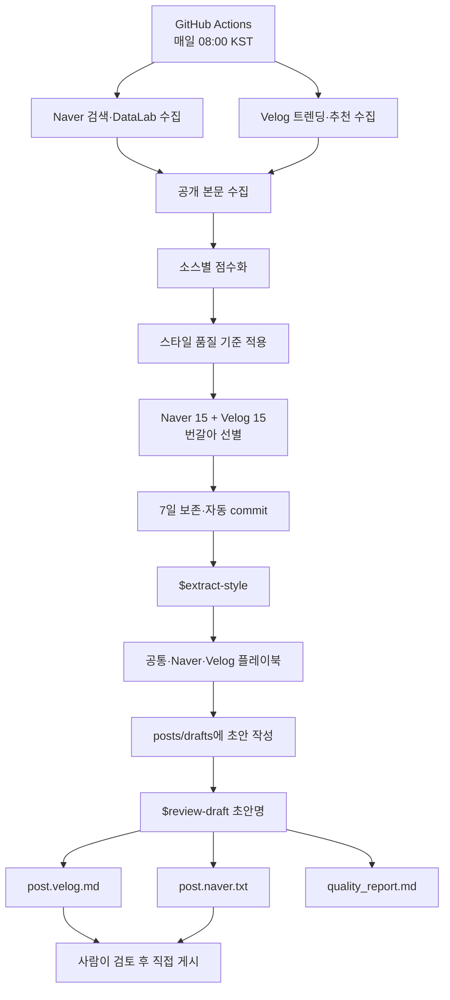

# Naver·Velog Tech Blog Pipeline

Naver·Velog Tech Blog Pipeline은 한국어 기술 블로그 제작을 지원하는 수집·분석·편집 자동화 프로젝트입니다. 네이버 블로그 검색 결과와 Velog 공개 인기 글을 정기적으로 수집하고, 선별한 글에서 플랫폼 공통 및 플랫폼별 작성 규칙을 추출합니다. 작성자가 제공한 Markdown 초안은 이 규칙을 바탕으로 검토한 뒤 Velog용 Markdown과 네이버 블로그용 평문으로 각각 생성합니다.

이 프로젝트는 참고 글의 원문을 재사용하거나 게시를 자동화하지 않습니다. 외부 글은 형식적 특징을 분석하는 데만 사용하며, 최종 콘텐츠의 사실과 경험은 사용자가 작성한 초안을 유일한 출처로 삼습니다.

## 주요 기능

- 네이버 블로그 검색 API와 DataLab을 이용한 기술 글 후보 수집
- Velog 트렌딩·추천 탭의 공개 글 수집
- 플랫폼별 순위·인기·최신성·기술 관련성 점수 계산
- 스타일 품질 기준과 Naver 15개·Velog 15개 쿼터를 적용한 참고 대상 선별
- 최근 7일 표본에서 공통·Naver·Velog 스타일 플레이북 추출
- 하나의 초안에서 Velog Markdown과 Naver 게시용 평문을 독립적으로 생성
- 플랫폼별 `humanize-korean` 윤문과 보호 사실 일치 검사
- GitHub Actions 기반 일일 수집, 결과 커밋 및 7일 보존

## 사용 범위

이 프로젝트는 다음과 같은 작업에 사용할 수 있습니다.

1. 한국어 기술 블로그의 최신 작성 형식과 플랫폼별 차이를 정기적으로 분석합니다.
2. 직접 작성한 트러블슈팅·프로젝트 회고 초안을 게시 가능한 글로 다듬습니다.
3. 같은 내용을 네이버 블로그와 Velog의 게시 형식에 맞춰 각각 준비합니다.
4. 초안의 사실, 날짜, 수치, 코드, URL이 두 완성본에서 일치하는지 검증합니다.

자동 게시와 외부 사실 검증은 지원하지 않습니다. 최종 검토와 게시 여부는 사용자가 결정합니다.

## 빠른 시작

### 요구사항

- Python 3.12 이상
- Naver Developers 애플리케이션의 Client ID와 Client Secret
- 스타일 추출과 초안 검토에 사용할 Codex CLI
- 저장소 로컬 스킬을 읽을 수 있는 Codex 환경

Velog는 로그인하지 않고 공개된 트렌딩·추천 페이지를 읽는다. 별도 계정이나 브라우저 자동화는 필요하지 않다.

### 설치

저장소를 복제하고 가상환경을 준비한다.

```bash
git clone https://github.com/dennis0405/naver-blog-trend.git
cd naver-blog-trend
python3 -m venv .venv
source .venv/bin/activate
pip install -r requirements.txt
```

### 로컬 환경 변수

저장소 루트에 `.env`를 만들거나 같은 값을 환경 변수로 내보낸다.

```dotenv
NAVER_API_PROVIDER=developers
NAVER_CLIENT_ID=replace_me
NAVER_CLIENT_SECRET=replace_me
```

현재 지원하는 provider는 `developers`다. `NAVER_API_PROVIDER=api_hub`는 아직 구현하지 않았다. `.env`는 Git이 추적하지 않는다.

### GitHub Actions용 Repository secrets

로컬 `.env`는 GitHub Actions에 전달되지 않는다. 자동 수집이나 `workflow_dispatch`를 실행하려면 저장소의 `Settings > Secrets and variables > Actions > Repository secrets`에 다음 값을 등록해야 한다.

- `NAVER_API_PROVIDER`: `developers`
- `NAVER_CLIENT_ID`: Naver Developers Client ID
- `NAVER_CLIENT_SECRET`: Naver Developers Client Secret

Velog 공개 페이지 수집에는 secret이 필요하지 않다. 위 세 값이 없거나 이름이 다르면 Naver 수집 단계가 실패한다.

### 기본 사용 순서

1. GitHub Actions의 `Daily Blog Pipeline`을 실행하거나 로컬 수집 명령을 사용해 참고 글을 수집한다.
2. 7일치 참고 데이터가 준비되면 Codex에서 `$extract-style`을 실행한다.
3. `posts/drafts/`에 경험과 기술적 근거를 담은 Markdown 초안을 작성한다.
4. `$review-draft {draft_name}`을 실행해 두 플랫폼의 완성본과 품질 보고서를 생성한다.
5. `quality_report.md`와 각 완성본을 검토한 뒤 플랫폼에 직접 게시한다.

세부 명령과 파일 형식은 아래의 각 단계에서 설명한다.

## 아키텍처 개요



| 구간 | 실행 위치 | 방식 | 산출물 |
|---|---|---|---|
| Naver·Velog 수집 | GitHub Actions 또는 로컬 | 매일 자동 / 필요 시 수동 | `raw/{date}/` |
| 점수화·참고 대상 선별 | GitHub Actions 또는 로컬 | 수집 직후 | `data/derived/`, `data/reports/daily/` |
| 보존 기간 정리 | GitHub Actions 또는 로컬 | 수집 직후 | 최근 7일 데이터 |
| 스타일 추출 | 로컬 Codex | 사용자가 실행 | 공통·플랫폼별 플레이북 |
| 초안 작성 | 로컬 | 사용자가 작성 | `posts/drafts/` |
| 초안 검토·윤문 | 로컬 Codex | 사용자가 실행 | Velog·Naver 완성본과 품질 보고서 |
| 발행 | Naver·Velog | 사람이 직접 수행 | 게시글 |

## 수집 및 선별 파이프라인

`.github/workflows/daily_collect.yml`은 매일 `23:00 UTC`, 한국 시간으로 다음 날 `08:00 KST`에 시작한다. Actions 화면의 `workflow_dispatch`로 직접 실행할 수도 있다.

### 1. Naver 검색 결과와 추이 수집

`configs/search_layers.yaml`의 discovery·target 검색어로 Naver 블로그 검색 API를 호출한다. discovery는 폭넓은 기술 글과 상단 노출 형식을 찾고, target은 실제로 쓸 주제와 가까운 글을 찾는다.

```bash
python3 -m src.collectors.collect_naver_search --date today --layers all
python3 -m src.collectors.collect_naver_trend --date today
```

기본 검색 결과는 검색어마다 관련도순 20개다. 결과와 DataLab 상대 추이는 아래에 저장한다.

```text
raw/{date}/naver_search.jsonl
raw/{date}/naver_trend.jsonl
```

일부 요청이 실패해도 가능한 범위는 계속 수집하고, 오류는 날짜별 report에 남긴다.

### 2. Velog 트렌딩·추천 글 수집

Velog의 공개 트렌딩 주간 탭과 추천 탭에서 각각 상위 20개를 가져온다.

```bash
python3 -m src.collectors.collect_velog_posts \
  --date today \
  --raw-dir raw \
  --limit-per-tab 20
```

두 탭에 같은 글이 있으면 canonical URL로 합치고, 탭별 순위·좋아요·댓글 신호를 함께 보존한다.

```text
raw/{date}/velog_posts.jsonl
```

공개 페이지 응답이 비었거나 예상 형식과 다르면 성공으로 기록하지 않고 작업을 중단한다. Velog의 페이지 구조가 바뀌면 파서 테스트 데이터와 클라이언트를 함께 고쳐야 한다.

### 3. 공개 본문 수집

Naver와 Velog 메타데이터를 모두 모은 뒤 본문 수집기를 한 번 실행한다.

```bash
python3 -m src.collectors.fetch_blog_bodies --date today --raw-dir raw
```

Naver는 설정에 맞는 상위 검색 후보를, Velog는 최대 20개를 고른다. 로그인이나 접근 제한은 우회하지 않는다. 수집한 본문과 manifest는 다음 경로에 쓴다.

```text
raw/{date}/blog_bodies.jsonl
raw/{date}/body_manifest.json
```

### 4. 소스별 점수화와 참고 대상 선별

```bash
scripts/rank_targets_local.sh today
```

내부에서는 `src.rankers.score_candidates`가 Naver와 Velog를 따로 평가한다. 두 플랫폼의 신호 의미가 달라서 같은 계산식을 억지로 공유하지 않는다.

| 점수 요소 | Naver | Velog |
|---|---:|---:|
| 상단 순위 | 0.35 | 0.25 |
| 인기 신호 | DataLab 0.20 | 좋아요·댓글 0.20 |
| 최신성 | 0.15 | 0.15 |
| 기술 관련성 | 0.15 | 0.20 |
| 여러 경로에서 반복 노출 | 0.10 | 0.10 |
| 작성자 새로움 | 0.05 | 0.10 |

인기 점수와 스타일 품질은 별개다. 상단에 노출됐더라도 본문이 지나치게 짧거나 문제·과정·검증 같은 경험 정보가 부족하면 스타일 표본에서 빠질 수 있다.

기본 선별 조건은 다음과 같다.

- 기술 관련성 0.30 이상
- 스타일 품질 0.30 이상
- 본문 수집 성공
- low-signal 후보 제외
- Naver 최대 15개, Velog 최대 15개
- 두 소스를 번갈아 배치하는 round-robin 순서

한쪽 후보가 부족해도 다른 쪽 후보로 빈 쿼터를 채우지 않는다. 그래야 특정 플랫폼의 형식이 플레이북 전체를 덮지 않는다.

```text
data/derived/candidates.sqlite
data/derived/{date}/reference_targets.jsonl
data/reports/daily/{date}.md
```

### 5. 7일 보존과 자동 commit

```bash
python3 -m src.maintenance.prune_raw_data \
  --raw-dir raw \
  --derived-dir data/derived \
  --report-dir data/reports/daily \
  --keep-days 7
```

날짜별 raw·derived·report와 SQLite의 오래된 후보 행을 지우고 최근 7일만 남긴다. 워크플로는 `raw`, `data/reports`, `data/derived`만 다음 메시지로 commit·push한다.

```text
chore: daily naver and velog blog pipeline
```

플레이북, 초안, 완성본은 자동 커밋 대상이 아니다.

## 로컬 실행

특정 날짜를 다시 처리할 때는 모든 명령에 같은 날짜를 넘긴다.

```bash
RUN_DATE=2026-08-11

python3 -m src.collectors.collect_naver_search --date "$RUN_DATE" --layers all
python3 -m src.collectors.collect_naver_trend --date "$RUN_DATE"
python3 -m src.collectors.collect_velog_posts --date "$RUN_DATE" --raw-dir raw
python3 -m src.collectors.fetch_blog_bodies --date "$RUN_DATE" --raw-dir raw
scripts/rank_targets_local.sh "$RUN_DATE"
python3 -m src.maintenance.prune_raw_data \
  --raw-dir raw \
  --derived-dir data/derived \
  --report-dir data/reports/daily \
  --keep-days 7 \
  --date "$RUN_DATE"
```

같은 날짜를 다시 실행하면 그날의 JSONL과 SQLite 행을 새로 만든다. raw는 그대로 두고 점수만 다시 계산하려면 `scripts/rank_targets_local.sh {date}`만 실행한다.

## 스타일 플레이북 생성

GitHub Actions가 올린 최신 데이터를 받은 뒤 저장소 로컬 스킬을 실행한다.

```bash
git pull origin main
```

```text
$extract-style
```

기준일을 고정하려면 날짜를 붙인다.

```text
$extract-style 2026-08-11
```

Python 진입점을 직접 실행해도 같은 작업을 한다.

```bash
python3 scripts/extract_style_local.py --as-of 2026-08-11
```

기본 범위는 기준일을 포함한 7일, 날짜별 상위 5개, 중복 제거 전 최대 35개다. `reference_targets.jsonl`과 `blog_bodies.jsonl`이 연결되는 정상 본문만 쓴다. 여러 날짜에 같은 URL이 있으면 더 높은 순위, 순위도 같으면 더 최근 자료를 남긴다.

추출은 날짜별 분석과 7일 집계, 두 단계로 진행한다. 날짜별 분석에서 공통·Naver·Velog 패턴을 나누고 마지막 집계에서 세 플레이북을 만든다. 원문은 격리된 임시 디렉터리에서 읽기 전용 Codex에 전달하며 셸 도구는 꺼 둔다. 출력에서 URL, 제목, 원문 중복, 필수 구성을 검사한 뒤 세 플레이북과 실행 보고서를 한 번에 교체한다. 하나라도 검증에 실패하면 기존 파일을 유지한다.

```text
knowledge/style/style_playbook.md
knowledge/style/platforms/naver.md
knowledge/style/platforms/velog.md
knowledge/style/runs/{as_of_date}.md
```

`style_playbook.md`는 두 플랫폼에 공통으로 적용할 구조와 편집 원칙을 담는다. 플랫폼별 파일은 서식과 읽기 흐름의 차이를 보완한다. `## Human Rules`와 자동 생성 영역 표시 바깥의 내용은 건드리지 않는다.

## 초안 준비

`posts/drafts/` 아래에 경험과 근거를 담은 Markdown 파일을 만든다.

```text
posts/drafts/2026-08-11-example.md
```

본문만으로도 검토할 수 있지만, frontmatter를 적어 두면 대상 독자와 공개 범위를 놓치기 어렵다.

```yaml
---
working_title: "글의 가제"
post_type: "troubleshooting"
target_reader: "이 문제를 처음 겪는 개발자"
target_queries:
  - "핵심 검색어"
privacy_level: "public_sanitized"
must_include:
  - "반드시 남길 경험과 결론"
must_not_include:
  - "서비스명과 내부 식별자"
status: "draft"
---
```

초안에는 직접 겪었거나 확인한 내용만 쓴다. 결과, 원인, 수치가 확실하지 않으면 그 사실도 초안에 표시한다. 실제 token, private key, 내부 host, IP, 개인 이메일, 사용자 데이터는 넣지 않는다.

## 플랫폼별 완성본 생성

파일 stem을 `review-draft`에 넘긴다. 축약한 이름을 쓸 때는 하나의 초안만 가리켜야 한다.

```text
$review-draft 2026-08-11-example
```

스킬은 초안을 유일한 사실 출처로 삼아 다음 순서로 처리한다.

1. 사실, 경험, 날짜, 수치, 이름, URL, 코드, 로그, 공개 제한을 보존 목록으로 만든다.
2. 공통 플레이북으로 사실 단위를 보존한 공통 구조 편집본을 만든다.
3. 같은 구조 편집본에서 Velog와 Naver 후보를 따로 편집한다.
4. Velog에는 Velog 플레이북과 Markdown 형식을 적용한다.
5. Naver에는 Naver 플레이북을 적용해 별도 Markdown 후보를 만든다.
6. 두 후보에 `humanize-korean`을 각각 적용하고 사실 보존 여부를 다시 확인한다.
7. Naver 후보만 규칙 기반 변환기로 평문으로 바꾼다.
8. 두 글의 날짜, 수치, 이름, URL, 명령, 코드 동작, 결론이 충돌하지 않는지 검사한다.

두 글은 제목, 문장, 소제목, 문단 길이, 전개 순서가 달라도 된다. `post.naver.txt`는 `post.velog.md`를 문법만 바꾼 파일이 아니다. 같은 초안에서 독립적으로 편집한 Naver 후보를 평문으로 렌더링한 결과다.

```text
posts/final/{draft_stem}/post.velog.md
posts/final/{draft_stem}/post.naver.txt
posts/final/{draft_stem}/quality_report.md
```

- `post.velog.md`: Velog에 올리는 Markdown 완성본
- `post.naver.txt`: Naver 편집기에 붙여넣는 평문 완성본
- `quality_report.md`: 사실 보존, 플랫폼 간 일치, 기밀, 윤문, 게시 형식 판정

판정은 `PASS`, `PASS_WITH_TODO`, `FAIL` 가운데 하나다. 실제 secret이나 개인정보, 핵심 근거 부족, 플랫폼 간 사실 충돌이 있으면 `FAIL`이다. 비핵심 `[확인 필요]`만 남으면 `PASS_WITH_TODO`가 된다.

원본 초안은 수정하지 않는다. 기존 final 디렉터리도 명시적인 교체 요청 없이는 덮어쓰지 않는다. commit, push, 게시 역시 자동으로 하지 않는다.

## 권장 운영 절차

1. daily workflow가 성공했는지 확인한다.
2. `data/reports/daily/{date}.md`에서 소스별 수집 수와 참고 대상 수를 확인한다.
3. 7일치 표본이 모였거나 상위 글 구성이 달라졌을 때 `$extract-style`을 실행한다.
4. 실행 보고서의 Naver·Velog 입력 수와 중복 제거 수를 확인한다.
5. 공통·Naver·Velog 플레이북을 사람이 읽어 본다.
6. `posts/drafts/`에 경험 기반 초안을 쓴다.
7. `$review-draft {draft_name}`으로 두 완성본과 품질 보고서를 만든다.
8. verdict, TODO, 마스킹, 플랫폼 간 사실 일치를 확인한다.
9. 각 완성본을 한 번 더 읽고 Naver와 Velog에 직접 게시한다.

데이터가 7일치 쌓였다고 스타일을 매일 다시 추출할 필요는 없다. 글감이나 상위 글의 형식이 충분히 바뀌었거나 새 글을 쓰기 전에 최신 규칙이 필요할 때 갱신하면 된다.

## 저장소 구조

```text
.
├── .agents/skills/
│   ├── extract-style/
│   └── review-draft/
├── .github/workflows/daily_collect.yml
├── configs/
│   ├── agent_config.yaml
│   ├── scoring.yaml
│   ├── search_layers.yaml
│   └── topic_taxonomy.yaml
├── data/
│   ├── derived/{date}/reference_targets.jsonl
│   ├── derived/candidates.sqlite
│   └── reports/daily/{date}.md
├── knowledge/style/
│   ├── style_playbook.md
│   ├── platforms/
│   │   ├── naver.md
│   │   └── velog.md
│   └── runs/{date}.md
├── posts/
│   ├── drafts/{draft}.md
│   └── final/{draft}/
│       ├── post.velog.md
│       ├── post.naver.txt
│       └── quality_report.md
├── prompts/
├── raw/{date}/
│   ├── naver_search.jsonl
│   ├── naver_trend.jsonl
│   ├── velog_posts.jsonl
│   └── blog_bodies.jsonl
├── scripts/
├── specs/naver_velog_dual_editorial_pipeline.md
├── src/
└── tests/
```

`humanize-korean`과 Naver 중간 후보는 `_workspace/`에 둔다. 이 디렉터리는 Git이 추적하지 않는다.

## 설정 파일

| 파일 | 조정 범위 |
|---|---|
| `configs/search_layers.yaml` | Naver 검색 계층·검색어, 본문 수집 수, Velog 본문 상한, 보존 기간 |
| `configs/scoring.yaml` | 플랫폼별 가중치, 스타일 품질 기준, 15:15 쿼터, 최신성 반감기 |
| `configs/topic_taxonomy.yaml` | 초안 유형과 권장 구성 |
| `configs/agent_config.yaml` | 수집 기능과 raw 저장 정책 |

검색어, 점수, 쿼터를 바꾸면 수집 결과뿐 아니라 다음 스타일 플레이북의 표본도 달라진다. 변경 이유와 기대 효과를 별도 커밋에 남기는 편이 좋다.

스타일 추출의 `--days × --top-per-day` 최대값은 35다. 범위를 키우거나 스타일 추출을 GitHub Actions에서 실행하려면 모델 호출 비용과 데이터 경계를 다시 검토해야 한다.

## 제한 사항

- Naver는 Developers API provider만 지원한다.
- 공개 HTML에서 읽을 수 없는 본문은 수집하지 못한다.
- Velog 페이지의 내부 payload 구조가 바뀌면 파서를 수정해야 한다.
- Naver의 인기 신호는 실제 조회수가 아니라 검색 순위와 DataLab 상대 추이다.
- 스타일 플레이북은 최근 표본에서 관찰한 경향이지 좋은 글의 절대 기준은 아니다.
- 초안 검토는 외부 사실을 자동으로 확인하지 않는다. 근거가 부족하면 작성자가 확인해야 한다.
- 발행과 발행 후 성과 측정은 자동화 범위 밖이다.
