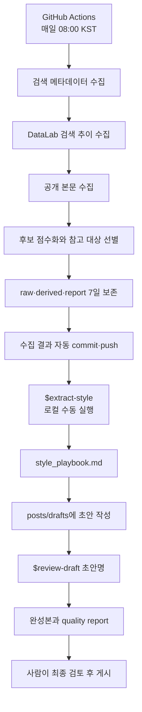

# Naver Tech Blog Agent

이 프로젝트는 네이버 기술 블로그의 검색 신호와 공개 본문을 매일 모은다. 후보 글을 고른 다음 최근 7일의 글쓰기 스타일을 로컬에서 추출한다. 이렇게 만든 스타일 플레이북은 기술 글 초안을 검토할 때 참고한다. 최종 게시 여부는 사람이 결정한다.

작업은 자동 수집과 수동 편집, 두 구간으로 나뉜다. GitHub Actions가 맡는 범위는 수집·랭킹·보존 기간 정리까지다. 스타일 추출과 초안 검토는 로컬 Codex 스킬로 실행한다. 네이버 블로그 발행은 자동화 범위에서 제외했다.

## 이 프로젝트가 하는 일

- discovery와 target으로 검색어를 나눠 네이버 블로그 메타데이터를 모은다.
- 네이버 DataLab 검색 추이와 공개된 블로그 본문을 함께 수집한다.
- 중복 URL을 합친 뒤 검색 순위, 추이, 최신성, 기술 관련성 등의 신호로 후보에 점수를 매긴다.
- 본문까지 확보된 기술 글에서 날짜별 참고 대상을 선별한다.
- raw, derived, daily report는 최근 7일치만 유지한다.
- 최근 7일의 참고 대상에서 원문이 아닌 추상적인 스타일 규칙만 뽑는다.
- 스타일 플레이북으로 사용자의 초안을 검토해 완성본과 품질 보고서를 만든다.

반대로 아래 작업은 하지 않는다.

- 네이버 블로그에 글을 자동 발행하는 기능
- 조회수, 좋아요, 댓글 같은 비공개·개인화 지표 수집
- 로그인, CAPTCHA, robots 정책 또는 서비스 제한 우회
- 외부 블로그의 원문 문장, 코드, URL을 스타일 플레이북에 저장하는 작업
- GitHub Actions에서 Codex를 실행해 스타일을 자동 추출하는 작업

## 전체 파이프라인



| 구간 | 실행 위치 | 실행 방식 | 주요 산출물 |
|---|---|---|---|
| 검색·추이·본문 수집 | GitHub Actions 또는 로컬 | 매일 자동 / 필요 시 수동 | `raw/{date}/` |
| 점수화·참고 대상 선별 | GitHub Actions 또는 로컬 | 수집 직후 자동 | `data/derived/`, `data/reports/daily/` |
| 보존 기간 정리 | GitHub Actions 또는 로컬 | 수집 직후 자동 | 최근 7일 데이터 |
| 스타일 추출 | 로컬 Codex | 사용자가 실행 | `knowledge/style/` |
| 초안 작성 | 로컬 | 사용자가 작성 | `posts/drafts/` |
| 초안 검토·윤문 | 로컬 Codex | 사용자가 실행 | `posts/final/` |
| 발행 | 네이버 블로그 | 사람의 최종 판단 | 게시글 |

## 요구사항

- Python 3.12 이상
- 네이버 개발자 애플리케이션의 Client ID와 Client Secret
- 스타일 추출과 초안 검토에 사용할 Codex CLI
- 저장소 로컬 스킬을 사용할 수 있는 Codex 환경

MVP 런타임은 Python 표준 라이브러리만 쓴다. 설치 절차의 일관성을 위해 `requirements.txt` 단계는 남겨 두었다. 현재 추가로 설치되는 패키지는 없다.

## 처음 설정하기

저장소를 내려받았다면 먼저 가상환경을 준비한다.

```bash
python3 -m venv .venv
source .venv/bin/activate
pip install -r requirements.txt
```

이어서 저장소 루트에 `.env`를 만든다. 같은 값을 실행 환경의 환경 변수로 내보내도 된다.

```dotenv
NAVER_API_PROVIDER=developers
NAVER_CLIENT_ID=replace_me
NAVER_CLIENT_SECRET=replace_me
```

`.env`는 Git 추적 대상이 아니다. 실제 credential은 코드나 로그, Markdown 문서에 남기지 않는다.

현재 쓸 수 있는 provider는 `developers`뿐이다. `NAVER_API_PROVIDER=api_hub`를 지정하면 미구현 오류를 내고 실행을 멈춘다.

로컬 `.env` 값은 GitHub Actions에 자동으로 전달되지 않는다. workflow를 실행하려면 GitHub 저장소의 `Settings > Secrets and variables > Actions > Repository secrets`에 아래 환경 변수 이름과 값을 각각 등록해야 한다.

- `NAVER_API_PROVIDER`: `developers`
- `NAVER_CLIENT_ID`: 로컬 `.env`에서 사용하는 실제 Client ID
- `NAVER_CLIENT_SECRET`: 로컬 `.env`에서 사용하는 실제 Client Secret

workflow는 이 Repository secrets를 실행 환경 변수로 주입해 네이버 API를 호출한다. secret 이름이 다르거나 값이 등록되지 않으면 자동 수집이 실패한다.

여기까지 설정했다면 수집을 시작하기 전에 테스트로 환경을 확인한다.

```bash
python3 -m unittest discover -s tests -p 'test*.py'
python3 -m compileall -q src scripts tests
```

## 매일 자동으로 실행되는 작업

`.github/workflows/daily_collect.yml`은 매일 `23:00 UTC`에 시작한다. 한국 시간으로는 다음 날 `08:00 KST`다. 필요하면 Actions 화면에서 `workflow_dispatch`를 선택해 수동으로 실행한다.

### 1. 검색 메타데이터 수집

첫 단계에서는 `configs/search_layers.yaml`에 적힌 discovery와 target 검색어로 네이버 블로그 검색 API를 호출한다.

```bash
python3 -m src.collectors.collect_naver_search --date today --layers all
```

discovery는 상단 노출 형식과 폭넓은 기술 글을 찾는 계층이다. target은 실제로 작성하려는 주제와 가까운 글을 찾는다. 기본 설정에서는 검색어마다 관련도순(`sim`) 결과 20개를 요청한다.

수집 결과는 `raw/{date}/naver_search.jsonl`에 저장한다. 일부 검색어가 실패해도 나머지 수집은 계속된다. 실패 내역은 `data/reports/daily/{date}.errors.md`에서 확인한다.

### 2. 검색 추이 수집

검색 메타데이터 다음에는 네이버 DataLab 추이를 가져온다. 같은 그룹에 속한 검색어는 하나의 요청 단위로 묶는다.

```bash
python3 -m src.collectors.collect_naver_trend --date today
```

기본 `--days` 값은 30이고 `--time-unit`은 `date`다. 결과는 `raw/{date}/naver_trend.jsonl`에 저장한다. 실패한 그룹의 내역은 `data/reports/daily/{date}.trend.errors.md`에 남는다.

### 3. 공개 본문 수집

검색 결과가 준비되면 설정 조건을 만족하는 상위 후보의 공개 본문을 가져온다.

```bash
python3 -m src.collectors.fetch_blog_bodies --date today --raw-dir raw
```

현재 설정에서는 discovery와 target의 각 검색어·정렬 조합에서 본문을 최대 1개씩 고른다. 한 요청은 20초가 지나면 중단한다. 응답은 최대 2,000,000바이트까지만 읽는다. 처리 범위는 공개 HTML과 네이버의 공개 main frame이다. 로그인이나 접근 제한은 우회하지 않는다.

가져온 본문과 보존 메타데이터는 두 파일로 나눠 저장한다.

```text
raw/{date}/blog_bodies.jsonl
raw/{date}/body_manifest.json
```

### 4. 후보 점수화와 참고 대상 선별

수집이 끝나면 후보를 평가한다. 다음 스크립트 하나가 점수 계산, SQLite 저장, 참고 대상 선별, 일일 보고서 생성을 차례로 수행한다.

```bash
scripts/rank_targets_local.sh today
```

내부적으로 실행되는 명령은 다음과 같다.

```bash
python3 -m src.rankers.score_candidates \
  --date today \
  --raw-dir raw \
  --derived-dir data/derived
```

같은 canonical URL을 가진 검색 결과를 한 후보로 묶고 아래 가중치로 점수를 매긴다.

| 신호 | 기본 가중치 |
|---|---:|
| 검색 순위 | 0.35 |
| 검색 추이 | 0.20 |
| 최신성 | 0.15 |
| 기술 관련성 | 0.15 |
| 여러 검색어에서 반복 노출 | 0.10 |
| 출처 새로움 | 0.05 |

기본 참고 대상에는 세 가지 조건이 붙는다. 기술 관련성 점수는 0.30 이상, 본문 수집 상태는 성공이어야 한다. low-signal 키워드에 걸린 후보는 제외한다. 하루 최대 개수는 `configs/scoring.yaml`의 `top_n_daily_report`가 정한다. 현재 기본값은 30이다.

점수화와 선별을 마치면 다음 파일이 생긴다.

```text
data/derived/candidates.sqlite
data/derived/{date}/reference_targets.jsonl
data/reports/daily/{date}.md
```

### 5. 7일 보존 정책 적용

랭킹 뒤에는 날짜 기준 데이터와 SQLite 행의 보존 기간을 정리한다.

```bash
python3 -m src.maintenance.prune_raw_data \
  --raw-dir raw \
  --derived-dir data/derived \
  --report-dir data/reports/daily \
  --keep-days 7
```

기준일을 포함해 최근 7일치만 남긴다. `raw/{date}/`, `data/derived/{date}/`, 날짜별 daily report를 정리하고 `candidates.sqlite`에서는 `candidates`와 `reference_targets`의 오래된 행을 지운다.

### 6. 결과 commit과 push

보존 기간 정리까지 끝나면 워크플로가 `raw`, `data/reports`, `data/derived`만 스테이징한다. 변경분을 아래 메시지로 커밋하고 현재 브랜치에 push하면 하루 작업이 끝난다.

```text
chore: daily naver blog pipeline
```

스타일 플레이북과 초안, 완성본은 자동 커밋에 포함하지 않는다.

## 전체 수집 파이프라인을 로컬에서 다시 실행하기

특정 날짜를 다시 처리할 때는 모든 단계에 같은 날짜를 넘겨야 한다.

```bash
RUN_DATE=2026-08-04

python3 -m src.collectors.collect_naver_search --date "$RUN_DATE" --layers all
python3 -m src.collectors.collect_naver_trend --date "$RUN_DATE"
python3 -m src.collectors.fetch_blog_bodies --date "$RUN_DATE" --raw-dir raw
scripts/rank_targets_local.sh "$RUN_DATE"
python3 -m src.maintenance.prune_raw_data \
  --raw-dir raw \
  --derived-dir data/derived \
  --report-dir data/reports/daily \
  --keep-days 7 \
  --date "$RUN_DATE"
```

같은 날짜로 다시 돌리면 해당 JSONL과 SQLite 행도 다시 만들어진다. 이미 있는 결과를 덮어쓰는 작업이므로 날짜를 한 번 더 보고 Git 상태도 확인한다.

수집 결과는 그대로 두고 랭킹만 다시 계산하려면 raw 데이터가 있는 날짜를 넘긴다.

```bash
scripts/rank_targets_local.sh 2026-08-04
```

## 최근 7일의 스타일 추출하기

스타일 추출은 로컬에서만 실행한다. 먼저 GitHub Actions가 올린 최신 수집 결과를 내려받는다.

```bash
git pull origin main
```

Codex에서는 저장소 로컬 스킬을 부르는 방법이 가장 간단하다.

```text
$extract-style
```

특정 기준일을 쓰려면 날짜를 함께 지정한다.

```text
$extract-style 2026-08-04
```

스킬 없이 Python 진입점을 직접 실행해도 결과는 같다.

```bash
python3 scripts/extract_style_local.py --as-of 2026-08-04
```

기본 선택 규칙은 다음과 같다.

- 기준일을 포함한 최근 7일
- 날짜별 `reference_targets.jsonl`의 상위 5개
- 중복 제거 전 최대 35개
- 같은 날짜의 `blog_bodies.jsonl`과 연결되는 정상 본문만 사용
- 여러 날짜에 같은 canonical URL이 있으면 더 높은 순위, 같은 순위면 더 최근 날짜를 우선

본문을 찾지 못한 날짜는 분석에서 빠진다. 전체 기간에 유효한 본문이 하나도 없다면 실행을 중단하며 기존 knowledge 파일은 그대로 둔다.

추출은 2-pass 구조다. 먼저 날짜별 batch를 만든다. 그 결과를 최종 aggregation으로 합친다. 외부 본문은 신뢰할 수 없는 JSON 데이터로 취급하며 격리된 Codex에만 전달한다. Codex의 shell 도구도 비활성화한다. 생성 결과는 URL, 원문 중복, 필수 heading, 크기 제한 검사를 거친다. 모든 검사를 통과해야 파일에 원자적으로 반영된다.

검증까지 성공한 실행은 다음 두 파일을 갱신한다.

```text
knowledge/style/style_playbook.md
knowledge/style/runs/{as_of_date}.md
```

`style_playbook.md`에서는 `## Human Rules`와 generated marker 바깥 영역을 그대로 보존한다. 스크립트와 스킬은 결과를 자동으로 commit하거나 push하지 않는다.

직접 실행용 옵션은 아래 명령에서 확인한다.

```bash
python3 scripts/extract_style_local.py --help
```

## 초안 작성하기

스타일 플레이북을 확인했다면 `posts/drafts/` 아래에 Markdown 초안을 작성한다.

```text
posts/drafts/2026-08-04-example.md
```

본문만 있어도 검토는 가능하다. 아래 frontmatter까지 적어 두면 대상 독자와 공개 범위를 놓치기 어렵다.

```yaml
---
working_title: "글의 가제"
post_type: "troubleshooting"
target_reader: "이 문제를 처음 겪는 개발자"
target_queries:
  - "핵심 검색어"
privacy_level: "public_sanitized"
must_include:
  - "반드시 남길 내용"
must_not_include:
  - "서비스명과 내부 식별자"
status: "draft"
---
```

`post_type`을 정할 때는 현재 제공하는 `troubleshooting`과 `project_review` 구성을 참고한다. 글 유형별 section 예시는 `configs/topic_taxonomy.yaml`에 정리돼 있다.

초안에는 직접 경험했거나 검증한 사실만 적는다. 실제 token, private key, 내부 host, IP 주소, 개인 이메일, 사용자 데이터, NDA 대상 정보는 제외한다. 명령과 로그에 민감한 값이 섞였다면 초안을 쓰는 단계에서 먼저 마스킹한다.

## 초안을 검토하고 완성본 만들기

초안을 검토하려면 파일의 stem을 `review-draft`에 넘긴다. 다른 파일과 겹치지 않는다면 파일명 뒤쪽만 지정해도 된다.

```text
$review-draft 2026-08-04-example
```

아래처럼 줄인 이름이 초안 하나만 가리켜야 한다.

```text
$review-draft example
```

이 스킬은 다음 순서로 동작한다.

1. 원본 초안과 Git 상태를 기록한다.
2. 초안의 사실, 수치, 날짜, 명령, 코드, 로그, 공개 제한을 보존 목록으로 만든다.
3. `knowledge/style/style_playbook.md`의 추상 규칙으로 구조와 가독성을 다듬는다.
4. 비밀값과 개인 정보를 검사하고 필요한 경우 마스킹한다.
5. 사용 가능한 경우 `humanize-korean`으로 한국어 문체를 한 번 더 윤문한다.
6. 보존 항목과 기밀 검사를 다시 수행한다.

원본 초안은 건드리지 않는다. 완성본과 보고서는 아래 경로에 새로 쓴다.

```text
posts/final/{draft_stem}/post.final.md
posts/final/{draft_stem}/quality_report.md
```

검토 결과는 `quality_report.md`의 verdict로 요약한다.

| 판정 | 의미 |
|---|---|
| `PASS` | 공개를 막는 항목이나 확인할 사실이 없음 |
| `PASS_WITH_TODO` | 비핵심 확인 항목이 남아 있음 |
| `FAIL` | 비밀값, 개인정보, 표절 위험, 핵심 근거 부족처럼 게시를 막는 문제가 있음 |

기존 완성본에는 사람이 손본 내용이 남아 있을 가능성이 있다. 명시적으로 덮어쓰라고 요청하지 않는 한 스킬이 교체하지 않는 이유다. commit, push, 발행도 자동으로 수행하지 않는다.

## 운영자가 확인할 순서

평소 운영에서는 자동 단계의 결과부터 확인한 뒤 수동 편집으로 넘어간다.

1. GitHub Actions의 daily workflow가 성공했는지 확인한다.
2. `data/reports/daily/{date}.md`에서 수집 수, 랭킹 수, 참고 대상 수를 확인한다.
3. 7일치 body-backed 참고 대상이 모이면 `$extract-style`을 실행한다.
4. `knowledge/style/runs/{date}.md`의 입력 수와 중복 제거 수를 확인한다.
5. `knowledge/style/style_playbook.md`의 추상 규칙을 사람이 검토한다.
6. `posts/drafts/`에 사실과 공개 범위를 갖춘 초안을 작성한다.
7. `$review-draft {draft_name}`으로 완성본과 품질 보고서를 만든다.
8. `quality_report.md`가 `PASS`인지, TODO와 마스킹 항목이 없는지 확인한다.
9. 완성본을 사람이 읽고 네이버 블로그에 직접 게시한다.

데이터가 7일치 모인 뒤에도 스타일 추출을 매일 반복할 이유는 없다. 검색 주제나 상위 글 구성이 충분히 달라진 시점에 다시 실행한다. 새 글을 쓰기 전에 최신 플레이북이 필요할 때도 갱신하면 된다.

## 저장소 구조

```text
.
├── .agents/skills/
│   ├── extract-style/             # 최근 7일 스타일 추출 스킬
│   └── review-draft/              # 초안 검토·완성 스킬
├── .github/workflows/
│   └── daily_collect.yml          # 매일 수집·랭킹·정리·push
├── configs/
│   ├── agent_config.yaml          # 수집 기능과 7일 보존 설정
│   ├── scoring.yaml               # 랭킹 가중치와 상위 개수
│   ├── search_layers.yaml         # discovery·target 검색어
│   └── topic_taxonomy.yaml        # 글 유형별 권장 구성
├── data/
│   ├── derived/
│   │   ├── candidates.sqlite
│   │   └── {date}/reference_targets.jsonl
│   └── reports/daily/{date}.md
├── knowledge/style/
│   ├── style_playbook.md
│   └── runs/{date}.md
├── posts/
│   ├── drafts/{draft}.md
│   └── final/{draft}/
│       ├── post.final.md
│       └── quality_report.md
├── prompts/                       # 로컬 스타일 추출용 prompt
├── raw/{date}/                    # 검색·추이·공개 본문 원본, 7일 보존
├── scripts/                       # 로컬 랭킹·스타일 추출 진입점
├── src/                           # 수집기, 클라이언트, 랭커, 정리 로직
└── tests/                         # 네트워크·실제 model 호출 없는 테스트
```

`humanize-korean` 같은 로컬 작업은 중간 산출물을 `_workspace/`에 둔다. 이 디렉터리는 Git에서 제외된다.

## 설정 바꾸기

| 파일 | 조정하는 항목 |
|---|---|
| `configs/search_layers.yaml` | 검색 계층, 검색어 그룹, 결과 수, 본문 수집 수, 보존 기간 |
| `configs/scoring.yaml` | 점수 가중치, 중복 페널티, 최신성 반감기, 일일 상위 개수 |
| `configs/topic_taxonomy.yaml` | 초안의 글 유형과 권장 section |
| `configs/agent_config.yaml` | 수집 기능 활성화 여부와 raw 저장 정책 |

검색어나 랭킹 가중치는 이후 수집 결과뿐 아니라 스타일 표본까지 바꾼다. 변경 전후를 비교하기 쉽도록 설정 수정은 별도 커밋으로 남기는 편이 안전하다.

스타일 추출에서 `--days`와 `--top-per-day`를 곱한 값은 최대 35다. 7일 또는 하루 5개보다 범위를 넓히거나 스타일 추출을 GitHub Actions에 넣으려면 설계와 보안 범위를 다시 검토한다. 자동 commit·push 권한을 추가하는 변경도 마찬가지다.

## 현재의 한계

- 네이버 Developers API provider만 구현되어 있다.
- 공개 HTML에서 읽을 수 있는 본문만 수집하며 페이지 구조나 접근 정책에 따라 실패할 수 있다.
- 검색 신호는 조회수나 실제 인기도가 아니라 API 검색 순위와 DataLab 상대 추이로 구성된다.
- 스타일 플레이북은 최근 7일 표본의 형식적 경향이며 좋은 글의 절대 기준이 아니다.
- 초안 검토는 외부 사실을 자동으로 검증하지 않는다. 근거가 부족한 내용은 작성자가 확인해야 한다.
- 발행과 발행 후 성과 측정은 자동화 범위 밖이다.
